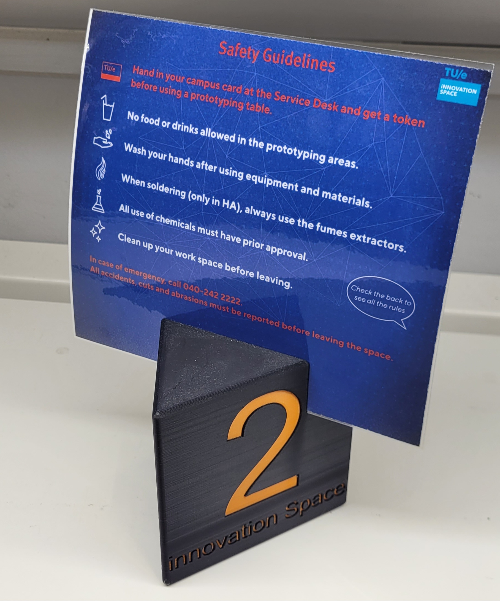

# innovation-space-table-numbers
3D models for information card holders with table numbers made for innovation Space TU/e.

bambuLabFiles folder contains project files for Bambu Studio with pre-made settings for printing. 
3D_models folder contains all stl files.

How it looks in real life:
 

